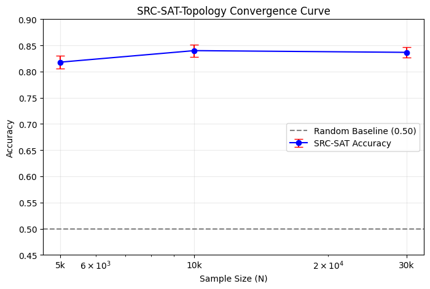

# 🧠 SRC-SAT-Topology


> Predict SAT satisfiability using **structural topology** — without solving.

---

## ⏱️ TL;DR — Why this Repo Matters

- **SAT normally requires NP-hard search** 🔍
- Here, we **predict SAT/UNSAT purely from structure**, using **graph Laplacian eigenvalues**.
- Achieves **0.84 accuracy** (baseline random = 0.50), stable up to **30,000 instances × 10 runs**.

This repository demonstrates that **structure alone** encodes strong predictive signal — supporting the broader theory of **SRC: Structure-Rich Computing**.

---

## 📊 Experiment — Convergence Curve (10× per N)

| Sample Size (N) | Mean Accuracy |
|-----------------|---------------|
| 5,000           | 0.818         |
| 10,000          | 0.840         |
| 30,000          | 0.837         |

Baseline (random): **0.50**



---

## 🧪 Method Summary (How it Works)

**Transform 3-SAT → Graph → Spectrum → Predict**

```text
3-SAT clauses
   ↓
Variable-Interaction Graph G = (V,E)
   ↓
Normalized Laplacian  𝓛 = I − D⁻¹ᐟ² A D⁻¹ᐟ²
   ↓
Top-k eigenvalues  λ₁…λₖ  →  "structural fingerprint"
   ↓
Logistic Regression → SAT / UNSAT

```

**Why it matters:**
We show that SAT complexity correlates with graph topology, enabling inference **without** running a solver.

---

## 🚀 Run Locally

```bash
git clone [https://github.com/jjwangart/SRC-SAT-Topology.git](https://github.com/jjwangart/SRC-SAT-Topology.git)
cd SRC-SAT-Topology
pip install -r requirements.txt

# Run the main experiment
python src/main.py

```

> **⏳ Runtime note**: 30k×10-round experiments may take 10–40min depending on CPU.

---

## 📁 Repository Layout

```text
SRC-SAT-Topology/
├── assets/
│   └── benchmark_convergence.png
├── docs/
│   ├── SRC_Theory_Definition.md
│   └── SRC_Technical_Report.pdf
├── src/
│   ├── main.py
│   ├── generator.py
│   └── topology_utils.py
├── experiments/
│   └── tutorial_notebook.ipynb  (planned)
├── LICENSE
├── README.md
└── requirements.txt

```

---

## 📚 Theory Link (SRC)

**SRC = Structure-Rich Computing**

Hypothesis: *Computation is governed by structure kernels (𝓚) independent of symbol-level content.*

More formal definitions forthcoming in:

* `docs/SRC_Theory_Definition.md`
* `docs/SRC_Technical_Report.pdf`

---

## 🧾 Citation

If you use this code or ideas in your research, please cite:

```bibtex
@misc{wang2025srcsattopology,
  title  = {SRC-SAT-Topology: Predicting SAT Satisfiability from Structural Topology},
  author = {Wang, Zijian},
  year   = {2025},
  howpublished = {\url{[https://github.com/jjwangart/SRC-SAT-Topology](https://github.com/jjwangart/SRC-SAT-Topology)}},
  note   = {Part of SRC — Structure-Rich Computing}
}

```

---

## 🛣️ Roadmap

* [x] Full-scale reproducibility test (5k–30k, 10× seeds)
* [ ] Interactive Colab notebook
* [ ] Extend SRC-Topology to alpha-fold-style protein graphs
* [ ] Integrate spectral kernel with LLM-based SAT guidance

```

```
