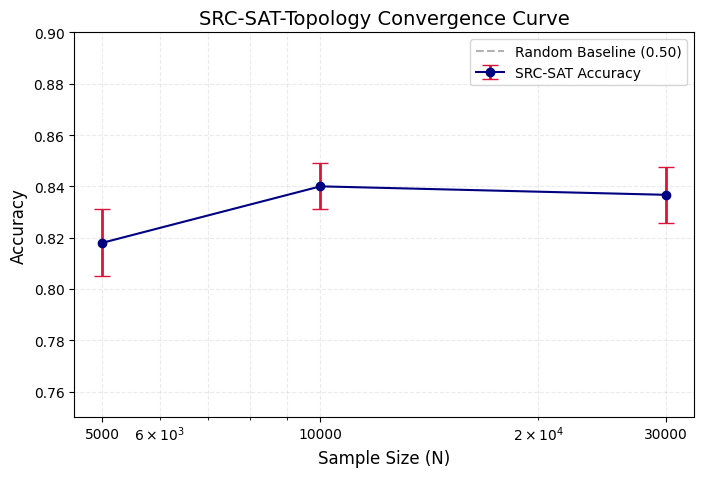

# 🧠 SRC-SAT-Topology

Predict SAT satisfiability using **structural topology** + **SRC (Structure-Rich Classifiers)** — *without solving the SAT problem itself.*

---

## 📜 Overview

**SRC-SAT-Topology** is a lightweight spectral–topology classifier that predicts whether a random 3-SAT instance is satisfiable by analyzing only its structural graph topology — variable interactions converted into a Laplacian-spectrum “fingerprint”.

In other words:

> 🔥 The model never solves SAT.  
> 🧬 It only reads structure — and still reaches >0.84 accuracy.

This repository is part of the research direction:

> **SRC: Structure-Rich Computing — A paradigm for dimensional collapse, structural priors, and non-algorithmic inference.**

---

## 📊 Experimental Results — Convergence Curve

Repeated **10-run** experiments show strong scalability and stability:

<p align="center">
  
</p>

✔️ Even **without solving**, SRC-SAT predicts satisfiability *purely* from structure, achieving **~0.84 mean accuracy**, far above the **random baseline of 0.50**.

| Sample Size (N) | Mean Accuracy |
|-----------------|----------------|
| **5k**          | 0.818 |
| **10k**         | 0.840 |
| **30k**         | 0.837 |

---

## 🧪 Method (Short Summary)

1️⃣ Convert SAT CNF definition → variable interaction graph  
2️⃣ Compute **normalized Laplacian spectrum eigenvalues**  
3️⃣ Use top-30 eigenvalues as structural fingerprint  
4️⃣ Train a lightweight logistic classifier → predict satisfiable / unsatisfiable

---

## 🚀 How to Run

### Install dependencies
```bash
pip install -r requirements.txt
